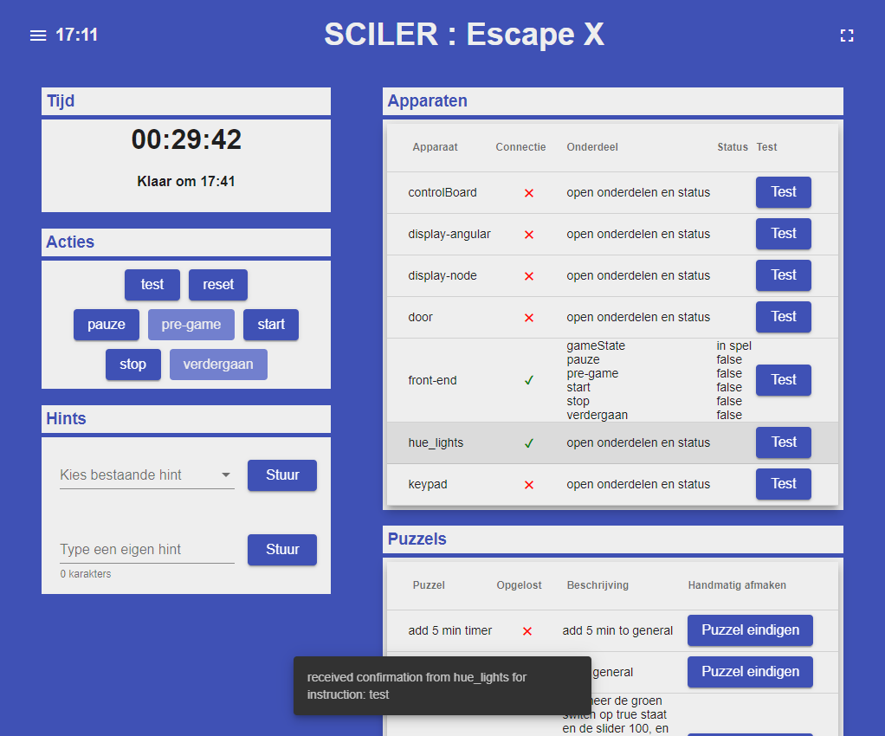

# BEP_1920_Q2
```
 ________  ________  ___  ___       _______   ________     
|\   ____\|\   ____\|\  \|\  \     |\  ___ \ |\   __  \    
\ \  \___|\ \  \___|\ \  \ \  \    \ \   __/|\ \  \|\  \   
 \ \_____  \ \  \    \ \  \ \  \    \ \  \_|/_\ \   _  _\  
  \|____|\  \ \  \____\ \  \ \  \____\ \  \_|\ \ \  \\  \| 
    ____\_\  \ \_______\ \__\ \_______\ \_______\ \__\\ _\ 
   |\_________\|_______|\|__|\|_______|\|_______|\|__|\|__|
   \|_________|                                            
```                                                           

[](https://travis-ci.com/IssaHanou/BEP_1920_Q2)
[](https://bettercodehub.com/)
[](https://www.gnu.org/licenses/gpl-3.0)


The [Front-end](front-end/README.md) is developed in Angular with TypeScript, all source code can be found in `front-end/`.

The [Back-end](back-end/README.md) is developed in Go, all source code can be found in `back-end/`.

The [Client Computer Library](cc_library/README.md) is developed in Python, all source code can be found in `cc-library/`.

All of these parts of SCILER communicate via a [MQTT Broker](broker/README.md), for which a [Mosquitto](https://mosquitto.org/) broker was used.

Each package has its own readme for further information specific to that package.


### Structure
```
SCILER
│   README.md
│
└─── back-end  
│   │   README.md
│   │   
│   └───resources
│   │   └───manuals
│   │   └───production
│   │   └───testing
│   │   
│   └───src
│       └───sciler
│           │   README.md
│           │
│           └───communication
│           │   
│           └───handler
│           │   
│           └───config
│
└─── front-end
│   │   README.md
│   │
│   └─── src
│
└─── cc_library
│   │   README.md
│   │
│   └───py_scc
│   │   │   README.md
│   │   └───sciler
│   │   
│   └───js_scc
│   │   │   README.md
│   │   
│   └───example_scripts_py_scc
│   └───example_scripts_js_scc
│
└─── broker
   │   README.md

```

## License
The license can be found in `LICENSE.md` in the root of this project.

