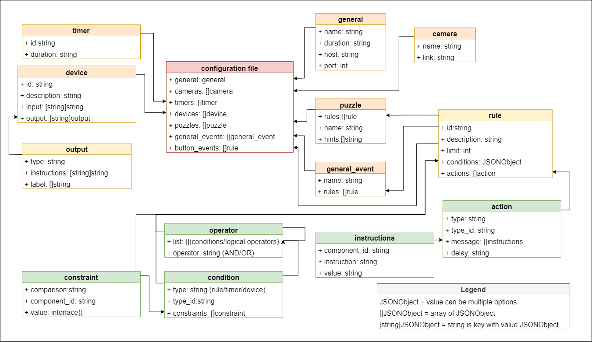

## Configuration file

This manual will help you write a configuration file for an escape room. 
The file should be written in JSON and all the tags necessary are explained here.
An example can be seen in `example.config.json`. The same format 
  
There are three main components to the file:

- `general`
- `cameras`
- `devices`
- `timers`
- `puzzles` 
- `general_events`
- `button_events`
- `rules` which are defined for puzzles

### General
This is the general information of the escape room. It includes the following tags: 

- `name`: this is the name of the escape room, this is a string, e.g. "Escape room X". This can be displayed in the front-end, so should be readable and in Dutch. 
- `duration`: this is the duration of the escape room, which should be a string in the format "hh:mm:ss".
- `host`: this is the IP address of the broker through which clients and back-end connect, formatted as a string.
- `port`: this is the port on which the broker runs, formatted as an integer. 

### Cameras
This will be a list of camera objects, that are set up in the room. An object has two properties:

- `name`: the name of the camera
- `link`: the link to the camera's IP address

### Devices
This will be a list of all devices in the room. Each device is defined as a JSON object with the following properties:

- `id`: this is the id of a device. Write it in camelCase, e.g. "controlBoard". This id should be unique compared to other device ids and also the rule ids as well as the timer ids.
- `description`: this is optional and can contain more information about the device. This can be displayed in the front-end, so should be readable and in Dutch. 
- `input`: defines the type of values to be expected as input. The keys are component ids and values are types of input (in string format).  
    Possible types are: "string", "boolean", "numeric", "array", or a custom name. 
- `output`: defines the outputs that can be expected, with their status and what instructions can be performed on these components
    - `type`: defines the type of values to be expected as output. Possible types are: "string", "boolean", "numeric", "array", or a custom name. 
    - `instructions`: this is a map of the name of an instruction to the type of argument the instruction takes. Possible types are: "string", "boolean", "numeric", "array" and "status". Status will be the status of a device's component specified in the action.
    - `label`: this is a list of possible labels this component listens to when an action gets called on a label.
    
### Timers
This will be a list of all the time-related actions/conditions. all timers have to be started in an action and be checked in a condition to be used.

- `id`: this will be the id of the timer. Write in camelCase and numbers are fine, e.g. "timerHint1". This id should be unique compared to other timers ids and also the rule ids as well as the device ids.
- `duration`: This will be the duration after which the timer will trigger to true and the conditions containing the timer will be checked to execute actions. The format is XhXmXs, each size optional, e.g. 1h30m30s, 40m30s, 1m30s

### Puzzles
This will be a list of puzzle objects, which have the following properties:

- `name`: name of puzzle. This can be displayed in the front-end, so should be readable and in Dutch. This name should be unique, also compared to the general event names.  
- `rules`: array of rule objects (see below)
- `hints`: array of hints (strings), specific to each puzzle. 
These can be displayed in the front-end, so should be readable and in Dutch. 

### General Events
General events have the following properties:

- `name`: name of event, for example, "start"
- `rules`: array of rule objects (see below)

### Button Events
Button events are events that happen on the click of a button in the front-end. 
The event in the config is a rule, as defined below.
The conditions can be empty or include conditions that the rule depends on, 
like stop can only be pressed when start is already pressed. When defined, the button is disabled until these conditions resolve. 

The buttons to manage the game state are configured in this section.
The front-end has output component `gameState` which keeps track of state of the game.
The button event conditions can depend on the `gameState` and the actions should alter the `gameState`.

The `gameState` can have several states, which can be defined through the config. 
Example states are: `gereed`, `in spel`, `gepauzeerd` and `gestopt`, but more states can be used.
Its default start-up status is `gereed`. The instruction for changing the `gameState` is `set state`.
 
An example for `start` is given below.

##### example
      "button_events": [
        {
          "id": "start",
          "description": "Als het spel start, moeten alle rode leds aan gaan en de groene uit",
          "limit": 1,
          "conditions": {},
          "actions": [
            {
              "type": "timer",
              "type_id": "timer2",
              "message": [
                {
                  "instruction": "start"
                }
              ]
            }
            {
              "type": "device",
              "type_id": "front-end",
              "message": [
                {
                  "instruction": "set state",
                  "component_id": "gameState",
                  "value": "in spel"
                }
              ]
            }
          ]
        }
      ]

### Rules
Rules are defined by:

- `id`: this is the id of a rule. Write it in camelCase, e.g. "solvingControlBoard". This id should be unique compared to other rule ids and also the device ids as well as the timer ids.
- `description`: this is optional and can contain more information about the rule. 
This can be displayed in the front-end, so should be readable and in Dutch.
- `limit`: this sets the number of times this rule can be triggered. If this is `0`, it means unlimited.  
- `conditions`: this is either a logical operator (i) defined by `operator` (either `AND` or `OR`) and `list` which is a list of conditions or other logical operators **or** this is a condition (ii) defined by `type`, `type_id` and `constraint`
    
    1. Logical operator
        - `operator`: this can be `AND` or `OR`
        - `list`: this is an array of conditions / logical operators
    2. Condition
        - `type`: this can be `rule`, `timer` or `device`.
        - `type_id`: this will be the id of a timer, rule or device, depending on the type.
        - `constraints`: this is either a logical operator (i) defined by `operator` (either `AND` or `OR`) and `list` which is a list of conditions or other logical operators **or** this is a constraint (ii) defined by `comp`, `value` and `component_id`      
            1. Logical operator
                - `operator`: this can `AND` or `OR`
                - `list`: this is an array of constraints / logical operators
            2. Constraint
                - `comparison`: this is the type of comparison and can be `eq`, `lt`, `gt`, `contains` , `lte`, `gte`, `not`. However, only `eq` will work on all types, `lt`, `gt`, `lte`, `gte` only on numeric, and `contains` only on arrays, `not` does not work on booleans.
                - `value`: this is the value on which the comparison is made. In case of `device` type, it should be in the same type as specified in the input of the device. 
                In the case of `timer` type, it should be boolean
                In the case of `rule` type, it should be numeric since the comparison will be done against the times the rule is executed
                - `component_id`: in the case of "device" type, this is the id of the component it triggers.
                In the case of "timer" type, this is non-existent.
                 
- `actions`: this is an array of actions:
        
    - `type`: this can be `device`, `timer` or `label`
    - `type_id`: the id of device, timer or label, depending on type respectively
    - `message` in case of type `device`: this defines a list of componentInstructions which have a:
        - `component_id`: this will be the id of a component in a timer or device
        - `instruction`: one of the instructions specified for this device and component
        - `value`: this is the value for the instruction of the type specified for this device and component, in case this type is "status", a string in the form "`device_id.component_id`" should be specified. 
    - `message` in case of type `timer`:   
           - `instruction`: one of the instructions for timer, e.g. `start`, `stop`, `pause`, `done`, `add`, `subtract`
           - `value`: optional, in case of `add` and `subtract` a time should be given in format XhXmXs 
    - `message` in case of type `label`:   
           - `instruction`: one of the instructions specified for the components with this label
           - `value`: this is the value for the instruction of the type specified for this device and component 
    - `delay` in case of type `device` or `label`: This is optional, this is a duration in format XhXmXs, if an action has a delay, the message will publish after this delay.

